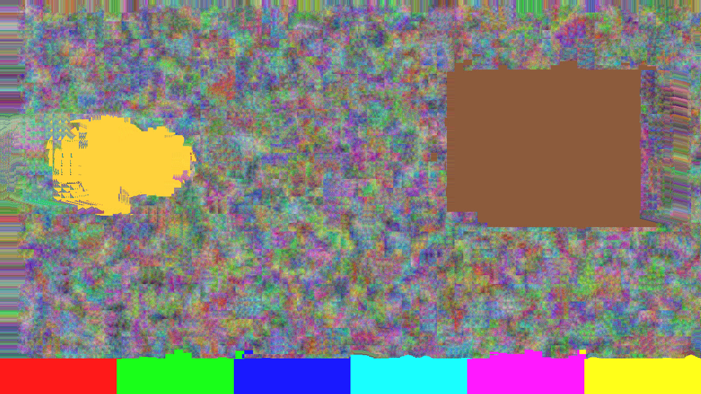
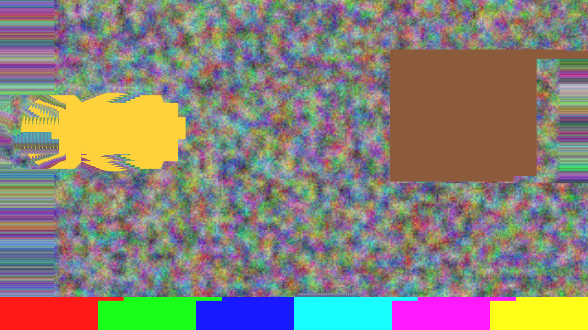
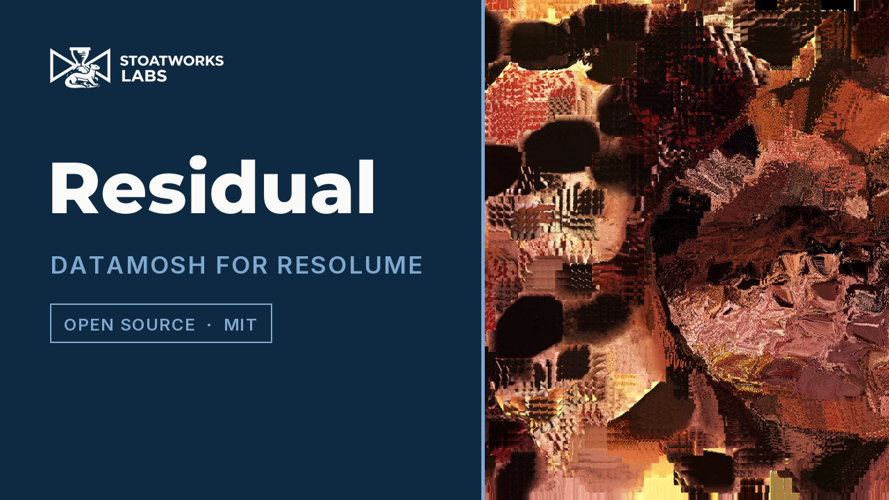

# Residual

> **AI-assisted project.** This codebase was created with [Claude](https://claude.com/claude-code)
> (Anthropic), directed and reviewed by a human author. The claims are *measured*, not
> asserted, and most of them are bitwise: with the I-frame dropped and the residual at
> zero, the decoded frame after a hard cut **is** the previous decoded frame block-copied
> by the vectors the estimator produced, 0 of 2,592,000 samples differing across six cases
> at two rasters (`rstest --mosh`); at Q 0 the codec is lossless, 0 of 49,766,400 samples
> differing (`--lossless`); a texture translated by (dx, dy) returns exactly (dx, dy) from
> every one of 29,961 interior blocks over 63 cases (`--vectors`); an I-frame is bitwise a
> function of its source alone (`--gop`); closed-loop drift grows by exactly one code a
> frame for 31 frames under the quantiser's dead zone (`--drift`); and seven deliberate
> perturbations of the model are asserted to make those checks *fail* (`--negative`). All
> fourteen sweepable controls are proven to change the picture (`tools/sweep.py`), and the
> bundle registers, instantiates and renders 120 frames in the fleet's `oxbow` host.
> **It has never been loaded into Resolume on macOS.** On Windows, a build of v0.1.0
> loads, registers and renders in Resolume Arena 7.27.1 with every control as declared,
> on software rendering. See [Status](#status).

Datamosh, built as a real codec, for Resolume Arena and Avenue.

Datamosh is not a glitch. It is a video decoder doing exactly its job with the wrong
information. A P-frame is a field of motion vectors plus a residual — the correction —
applied to **the last frame the decoder reconstructed**. Take away the I-frame at a scene
cut and the decoder keeps painting the *old* picture with the *new* scene's motion. Take
away the residual and nothing ever corrects it. Repeat one frame's vectors and the pixels
keep flowing in that direction. That is the bloom.

So this is the codec — a block-matching motion estimator, closed-loop prediction from the
decoder's own reconstructed frame, a quantised 8×8 DCT residual, and a GOP — and then
controls that break exactly one piece of it at a time. Every datamosh look is a named
failure of a named stage.

The demo card through the plugin, rendered by its own offline harness (`rstest --out`),
not captured from Resolume. The card cut to a different scene sixteen frames earlier. With
the I-frame dropped and nothing added back, the decoder has been block-copying the old
picture along the new picture's motion vectors ever since, and the yellow disc has been
smeared by them.

## What falls out of it

Nothing below is drawn. There is one decoder loop — `decoded = prediction + residual`,
where the prediction is the last decoded frame moved by the vectors — and these are what
happens when one term of it is taken away:

- **Drop I** — the I-frame at a scene cut never arrives, so the decoder carries on
  predicting the new scene from the old picture. The classic mosh.
- **Residual Gain at zero** — nothing corrects the prediction, ever. The picture is
  pure motion: whatever was on screen flows wherever the vectors say.
- **Vector Hold** — one frame's vectors are reused for the next N. The pixels keep
  travelling in the direction they were going. The bloom.
- **Vector Scale** — the vectors are multiplied. Everything moves too far, or (at 0) not at all.
- **Q** — the residual is quantised harder. Blocks, and a closed loop that slowly loses
  the picture between I-frames.
- **Refresh** — one I-frame, now. The operator's clean-up button, which works whatever
  Drop I says.

Vector Hold at 30 frames and Vector Scale at 2. The estimator found the disc moving
once; the decoder has been applying that motion, doubled, ever since.

*[Watch it](https://www.youtube.com/watch?v=2KrF01zB9mA) — 50 seconds:
the old picture carried on by the new clip's motion when the I-frame is dropped at a cut, Refresh cleaning it up, the bloom from held and stretched vectors, a mosh healing at a Residual Gain just above zero, hard quantisation drifting until the next I-frame, and the vector field itself. Every frame is the real plugin's output: an FFGL plugin has no window,
so the footage is rendered by this repository's own offline harness
(`rstest --pipe`, driven by a cue sheet) rather than filmed off a screen, and
the clips are Resolume's bundled demo media.*

## Controls

**Encoder** — the codec as an encoder would build it.

- **Block Size** — 8, 16 or 32 pixels. The motion block; the residual is always 8×8.
- **Search Range** — ±1 to ±32 pixels, searched hierarchically on a luma pyramid.
- **Half Pel** — refine each vector to half a pixel, with the codec's rounded averages.
- **GOP** — an I-frame every N frames, 1 to 250.
- **Scene Cut** — insert an I-frame where the motion-compensated difference says the
  picture changed, as encoders do.
- **Scene Threshold** — how large that difference has to be: 2 to 64 codes per pixel.

**Residual** — what is added back.

- **Q** — the luma quantiser. 0 is a real bypass and the codec is lossless; above it the
  step runs from 2 to 512.
- **Residual Gain** — what the dequantised residual is multiplied by before it is added
  back. 1.0 is honest; 0 is a decoder that never corrects. I-frames always reconstruct
  at unity.
- **Chroma Q** — the quantiser for Co and Cg.

**Mosh** — the breaks.

- **Drop I** — Off, Next (the next I-frame, once), All, or On Onset (an audio onset
  arms it).
- **Vector Hold** — reuse one frame's vectors for 1 to 60 frames.
- **Vector Scale** — 0 to 4×, in half-pel units.
- **Refresh** — force one I-frame.
- **Audio** — Resolume's 64-bin spectrum, for On Onset. The detector is primed on the
  first frame, so a clip trigger does not read as a hit.

**View**

- **Show Vectors** — draw the vector field over the picture.
- **Mix** — crossfade with the untouched clip.

## How it works

Per frame:

1. **Copy** the host's texture into an 8-bit integer texture, exactly, and take the
   codec's own luma from it (YCoCg-R's Y). Build a luma pyramid.
2. **Search.** From the coarsest level down, one fragment per (block, candidate)
   computes a sum of absolute differences against the *previous source frame*, and one
   fragment per block keeps the best. Equal SADs prefer the smaller vector, zero first,
   so a flat block is deterministically (0, 0). Level 0 optionally refines to half a
   pixel.
3. **Decide I or P** from the GOP, the scene-cut difference, the Refresh trigger and the
   Drop I latch. A frame with nothing to predict from — the first, or the one after a
   resize — is an I-frame whatever Drop I says.
4. **Predict**: the last *decoded* frame block-copied by the vectors. A whole-pel vector is
   one texel fetch; a half-pel one is the codec's `(a + b + 1) >> 1`.
5. **Residual**: source minus prediction, in Y/Co/Cg, through a separable 8×8 DCT,
   quantised at Q and Chroma Q, back again, scaled by Residual Gain, rounded, added to the
   prediction, clamped. That is the decoded frame, and it is the next frame's reference.
6. **Composite** the decoded frame (or a mix) to the host.

Everything the decoder keeps is an integer texture read with `texelFetch`, so there is no
filtering anywhere in the loop and no float-to-fixed conversion between a shader and a
byte. That is what lets the harness make bitwise claims. The colour transform is
YCoCg-R, the reversible integer form: an 8-bit RGB triple goes to Y in 0..255 and Co, Cg
in −255..255 and comes back exactly, for all 16,777,216 of them — which is why "Q 0 is
lossless" is a bitwise claim and not a tolerance.

## Status

**v0.1.0, 2026-09-23, and honestly early.**

- **It has never been loaded into Resolume on macOS.** Everything numeric here was
  compiled, rendered and measured offline against the real plugin class in a headless GL
  context, plus one load in the fleet's own [oxbow](https://github.com/stoatworks-labs/oxbow)
  host, which confirms it registers, instantiates and renders as `SW Residual` / `RS01`
  / effect.
- **Windows, in Resolume Arena 7.27.1** (win-lab, Mesa llvmpipe, no GPU, 2026-09-23): a
  CI build of this source loads from Extra Effects, registers as `SW Residual` / `RS01` /
  effect, all 22 host controls match the declaration in name, order, type, range and
  default, it renders, and Arena's log stays clean: 8 of 9 of the fleet gate's checks.
  The ninth, controls, read Search Range, Half Pel, Scene Cut, Scene Threshold and Drop I
  dead, because the gate holds a still picture and a codec's motion search and scene-cut
  detector have nothing to find in one — no motion, no cut. `tools/sweep.py`, which feeds
  moving pictures and cuts, proves all five live. Software rendering says nothing about a
  GPU or about speed.
- 296 assertions across nine check suites, all passing (`tools/verify.sh`), locally and
  in CI on GitHub's GPU-less macOS runner. Every tolerance is a lattice — one code value, one block, or none at all — and seven negative
  controls prove the checks can fail. One character changed in the shipped predict shader
  fails `--mosh` in all six cases. The audit of every check is in `AGENTS.md`.
- Measured on macOS (Apple Silicon) at the defaults (16-pixel blocks, ±16 search,
  three pyramid levels): **5.1 ms/frame at 720p, 6.1 at 1080p, 14.0 at 4K**, of which the
  one-integer scene-cut readback — a CPU–GPU synchronisation — is roughly 1 ms. The
  motion search is the cost, and it scales with the search: 8-pixel blocks at ±32 run
  at about 50 ms a frame at every raster, which is not a setting for a show. Never
  timed on Windows, on Intel (where it has never run), or on a rasteriser without a GPU
  behind it.
- **Chroma is coded at full resolution.** Co and Cg get their own quantiser but are not
  subsampled to 4:2:0; the chroma-block look of a real mosh is not here yet.
- **The scene-cut detector only judges frames whose vectors are fresh.** Under Vector
  Hold, held vectors carry the SAD of the frame they were found on, which says nothing
  about this one.
- **Alpha is not coded.** The decoded frame carries the current source's alpha through.
- No factory presets. No OpenFX port, no browser demo — neither is required for 0.1.0.
- The user guide is [docs/USER-GUIDE.md](docs/USER-GUIDE.md); the About block's fourth
  button opens it.

## Installing

Copy `Residual.bundle` (macOS) or `Residual.dll` (Windows) into

    ~/Documents/Resolume Arena/Extra Effects        (or "Resolume Avenue")
    Documents\Resolume Arena\Extra Effects           (Windows)

and restart Resolume. It appears under **Effects** as **SW Residual**.

## Building

    git clone --recursive https://github.com/stoatworks-labs/residual
    cmake -B build -DCMAKE_BUILD_TYPE=Release
    cmake --build build --parallel
    cmake --install build          # into Arena's Extra Effects, macOS

C++17 + GLSL 4.10, CMake, FFGL 2.1 (SDK vendored as a submodule, pinned to `b1afaf9`). The
macOS build is universal (arm64 + x86_64) by default; add `-DCMAKE_OSX_ARCHITECTURES=arm64`
for a faster development build. Windows needs GLEW from vcpkg — see
`.github/workflows/release.yml` for the exact configure line.

## Building and testing

The offline harness renders the real plugin class headlessly and measures it:

    ./build/rstest --out /tmp/f.png --size 1920x1080 --frames 40 --set "Drop I=2" --set "Residual Gain=0"
    ./build/rstest --list                                           # every control and its range
    ./build/rstest --transform                                      # the arithmetic; no GL at all
    ./build/rstest --vectors --lossless --mosh --gop                 # the bitwise claims
    ./build/rstest --drift --resize --onset                          # the codec's behaviour over time
    ./build/rstest --negative                                       # those checks, perturbed, must fail
    ./build/rstest --bench --frames 60                              # 720p through 4K
    ffmpeg -i in.mov -f rawvideo -pix_fmt rgba - \
      | ./build/rstest --pipe --size 1920x1080 --fps 30 --script cues.txt \
      | ffmpeg -f rawvideo -pix_fmt rgba -s 1920x1080 -r 30 -i - out.mp4   # footage through it
    python3 tools/sweep.py                                          # no control is silently dead
    tools/verify.sh                                                 # all of it, on a fresh universal build

`tools/verify.sh` does the release job's work locally — universal build, `lipo`, the plist,
the exact `codesign` the release runs, and a real host load — because a check that only runs
in CI after a tag is a check that will catch you after the tag.

## Diagnostics

Residual writes a plain-text log every time it runs:

    ~/Library/Logs/residual/residual.YYYY-MM-DD.log                     (macOS)
    %LOCALAPPDATA%\residual\logs\residual.YYYY-MM-DD.log                (Windows)

It records the build, the GL driver, any shader that would not compile, every resize
(which restarts the GOP with an I-frame), and at frame 60 the host's clock, the block grid
and the motion-compensated difference. If you are filing a bug, this is the single most
useful thing to attach.

<!-- attributions:start -->
This project is built on other people's work — see [ATTRIBUTIONS.md](ATTRIBUTIONS.md).
<!-- attributions:end -->

## Licence

MIT — see [LICENSE](LICENSE).
