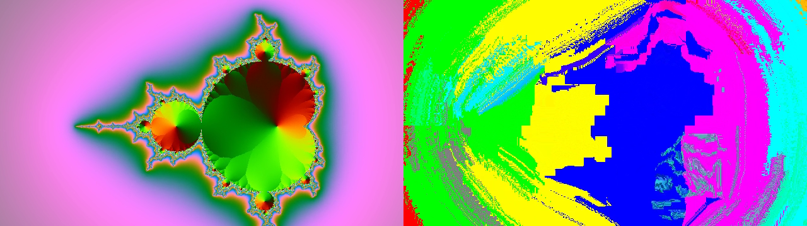

# Residual user guide

Residual is **datamosh for [Resolume](https://resolume.com) Arena and Avenue, built as a real
video codec**, as an FFGL effect. It does not paint a glitch over a clip. It runs the clip through
a small encoder and decoder of its own — a block-matching motion search, a prediction from the
decoder's own last frame, a quantised 8×8 DCT residual and a GOP — and gives you controls that
break one stage of that loop at a time. Every datamosh look is one of those breaks.


*The repo's demo card through the plugin, rendered by the offline harness rather than captured
from Resolume. The card cut to a different scene sixteen frames earlier. With the I-frame dropped
and nothing added back, the decoder has been moving the old picture along the new picture's
motion ever since.*

> **Before you rely on this:** released at **v0.1.0**, and honestly early. The codec is measured
> rather than asserted, by a harness that drives the real plugin class, and most of the claims are
> bitwise: with the I-frame dropped and the residual at zero, the decoded frame after a hard cut
> **is** the previous decoded frame block-copied by the vectors the search found — 0 of 2,592,000
> samples differing across six cases at two resolutions; at Q 0 the codec is lossless, 0 of
> 49,766,400 samples differing; a picture moved by (dx, dy) returns exactly (dx, dy) from every
> one of 29,961 interior blocks; closed-loop drift grows by exactly one code value a frame for 31
> frames; and seven deliberate faults are shown to make those checks fail. All 14 controls that
> act on the picture are shown to change it. It has **never been loaded into Resolume on macOS**
> — the one host it has run in is the fleet's own test host, `oxbow`, for 120 frames.
> On Windows: (to be filled after the Arena run).
> Try it on a spare layer before you put it in a show.
>
> This codebase was created with AI assistance, directed and reviewed by a human author.

---

## Installing

Every download carries one effect, **SW Residual**. Drop it into Resolume's effects folder and
restart Resolume:

```
macOS    ~/Documents/Resolume Arena/Extra Effects/
Windows  %USERPROFILE%\Documents\Resolume Arena\Extra Effects\
```

Avenue uses the same layout under its own folder name. The effect then appears in the effects
browser as **SW Residual**.

The macOS download is a universal build (Apple silicon and Intel), as a `.dmg` or a `.zip`. It is
**Developer ID-signed and notarised**, so the bundle simply loads. The
Windows download is an x64 installer or a `.zip`. It is not code-signed, so the installer trips
SmartScreen once: **More info** → **Run anyway**.

---

## A decoder doing its job with the wrong information

A compressed video is mostly not pictures. Every so often there is an **I-frame** — a whole
picture, coded on its own. Every frame in between is a **P-frame**: a set of motion vectors that
say "this block of the picture came from over there in the last frame", and a **residual** — the
small correction for whatever the vectors got wrong. A decoder rebuilds each P-frame by moving
blocks of *the last frame it decoded* and adding the correction.

Datamosh is what happens when one of those terms is missing. Nothing in the decoder is broken;
it does exactly what it always does, with the wrong information:

- **No I-frame at a cut.** The decoder never gets the new scene's picture, so it carries on
  moving blocks of the *old* picture around — with the *new* scene's motion. That is the
  classic mosh.
- **No residual.** Nothing ever corrects the prediction, so whatever is on screen just flows
  wherever the vectors say.
- **The same vectors again and again.** The pixels keep travelling the way they were going.
  That is the bloom.

Residual is that decoder, with the encoder in front of it, and the controls are the codec's own
controls with one of them set to a value no encoder would choose. **The motion always comes from
the clip** — the encoder searches your clip's frames against each other — and it is always
applied to **the decoder's picture**. That split is the whole effect.

---

## Start here

Put SW Residual **on a layer** (not on a clip) with something moving in it, and leave every control
alone. The defaults are an honest codec at a moderate quantiser: 16-pixel blocks, a ±16 pixel
search, an I-frame every 30 frames and at every scene cut, and the residual added back in full.
It looks like the clip, very slightly compressed. **Nothing moshes until you break something.**

Why the layer: an effect on a clip belongs to that clip, so the next clip you trigger arrives
with its own copy of the effect and nothing for it to predict from. On the layer, the effect sees
the cut.

Then, in this order:

1. **Drop I → All, Residual Gain → 0.** Now trigger a different clip on the layer. The old
   picture stays on screen and starts moving with the new clip's motion.
2. **Refresh.** One clean I-frame, right now, whatever Drop I says. The clean-up button. Press
   it, cut again, and the mosh starts over from the new picture.
3. **Vector Hold → 30, Vector Scale up.** The bloom: one frame's motion applied again and again,
   and stretched.
4. **Put Residual Gain back to 0.5, then raise Q.** A working codec again, but a coarse one:
   blocks, and a picture that slowly loses itself between I-frames.



*Left, the source fifty frames after a hard cut from colour bars to a zooming fractal. Right, the
same frame through the plugin with Drop I on All and Residual Gain at zero from just before the
cut. The decoder never saw the fractal; it has been moving the colour bars along the fractal's
zoom ever since. Rendered through the harness's `--pipe` mode from ffmpeg's own test sources, not
captured from Resolume.*

---

## Time is counted in frames

A frame here is **one rendered frame of your composition**. The GOP, Vector Hold and the onset
detector all count frames and never read a clock, as a codec does. The consequence is that a GOP
of 30 is half a second at 60 fps and a whole second at 30 fps, and a Vector Hold of 30 lasts
twice as long at 30 fps as at 60.

The codec keeps state from one frame to the next — the last decoded picture is the next frame's
reference — and every frame Resolume renders moves it on one step. Nothing in FFGL tells a
plugin with memory if a host renders the same frame twice.

---

## The Encoder group

The codec as an encoder would build it. These decide what the motion is and when a clean picture
arrives.

**Block Size** — 8, 16 or 32 pixels; 16 by default. The size of the blocks the motion search
moves. The residual is always coded in 8×8 blocks whatever this says, as in every codec from
MPEG-1 to H.264. Smaller blocks follow motion more finely and cost more: 8-pixel blocks at a wide
search are the most expensive thing the plugin can do (see Performance). Larger blocks move the
picture in bigger slabs.

**Search Range** — ±1 to ±32 pixels; 16 by default. The furthest a block can be found to have
moved in one frame. The search is hierarchical: it looks across the whole range on a small copy of
the picture and refines on each larger copy, so a wide range is cheaper than it sounds. Motion
faster than the range is not found; the block takes the best match within it instead, which under
a mosh is just a different wrong answer.

**Half Pel** — off by default. Refines every vector to half a pixel, the way MPEG codecs do.
A half-pixel copy is the rounded average of two or four neighbouring pixels, so a mosh carried
for many frames under Half Pel softens as it travels.

**GOP** — 1 to 250 frames; 30 by default. An I-frame every this many frames. GOP 1 makes every
frame an I-frame, which is a codec with no prediction in it and nothing to mosh (unless Drop I
drops them). A long GOP lets
drift build up between clean pictures.

**Scene Cut** — on by default. Inserts an I-frame where the picture changes more than motion can
explain, as encoders do. This is the I-frame the classic mosh drops: with Scene Cut on and Drop I
on Off, a cut to a different clip is clean.

**Scene Threshold** — how different a frame has to be, *after* the motion has been accounted
for, to count as a cut: 2 to 64 code values per pixel of luma, on a logarithmic slider. The
default, halfway, is 11.3. Lower it to catch softer cuts; raise it if ordinary fast motion is
triggering I-frames. The default was judged on synthetic pictures and real footage may want it
lower.

The cut detector only judges frames whose motion was freshly searched. While Vector Hold is
reusing old vectors it has nothing current to judge by, so a cut that lands during a hold is not
seen.

---

## The Residual group

What is added back to the prediction — the correction.

**Q** — the quantiser for luma. **0 is a real bypass**: the correction is not even rounded and
the codec is lossless. Above zero, the quantiser step runs from 2 to 512, doubling every eighth
of the slider; the default, 0.3, is a step of about 10.6. Higher Q throws more of each correction
away: flat 8×8 blocks, colour banding, and a closed loop that slowly loses the picture between
I-frames and snaps back at each one.

**Residual Gain** — what the correction is multiplied by before it is added back, 0 to 2. **Half
way is exactly 1.0**, the honest setting and the default. At 0 nothing ever corrects the
prediction and the picture is pure motion. In between, each P-frame fixes only part of what the
prediction got wrong: at 0.25 on the slider (a gain of 0.5) whatever the vectors miss halves
every frame, so a mosh heals over a handful of frames instead of snapping clean. Above half way
it over-corrects — what was wrong comes out wrong the other way — and at the top the error flips
sign every frame and never shrinks, which reads as shimmer on every moving edge.

**I-frames always reconstruct at full strength whatever Residual Gain says**, so Refresh and an
arriving I-frame always give you a picture, even at gain 0.

**Chroma Q** — the same quantiser for the colour-difference channels (the codec works in Y, Co,
Cg, a reversible integer form of luma and two colour differences); 0.4 by default, a step of
about 18.4. Raise it on its own for colour that smears and blocks while the detail holds. The
colour is coded at full resolution, not the quarter resolution most codecs use, so the
chroma-block look of a real H.264 mosh is not here yet.

---

## The Mosh group

The breaks.

**Drop I** — which I-frames the decoder never receives.

| Drop I | What it does |
| --- | --- |
| **Off** | The default. Every I-frame arrives. |
| **Next** | The next I-frame that would have arrived — from the GOP or a scene cut — is dropped, once. Choosing Next arms it; it is spent when it drops one. Choose it again to re-arm. |
| **All** | No I-frame from the GOP or a scene cut ever arrives. The classic mosh, held for as long as you like. |
| **On Onset** | Every audio onset on the Audio input arms the same one-shot latch as Next. A hit just before a cut moshes the cut. |

Three pictures are never dropped: the very first frame, the frame after the composition changes
resolution (there is nothing left to predict from), and a Refresh. A dropped I-frame still ends
its GOP — the encoder made it, the decoder never saw it — so the next one comes a GOP later, as
in the real thing.

For a mosh on a particular cut, **All** is the dependable choice. **Next** drops the *next*
I-frame, and if the GOP delivers one before your cut, that is the one it spends.

**Vector Hold** — 1 to 60 frames; 1 by default. One frame's motion vectors are reused for this
many frames before the next search. At 1 the vectors are fresh every frame. Held higher under
Drop I All and Residual Gain 0, the picture keeps flowing in the direction it was going: the
bloom. The motion search is skipped on held frames, so a hold is also cheaper.


*Vector Hold at 30 frames and Vector Scale at 2×, on the demo card, through the harness. The
estimator found the disc moving once; the decoder has been applying that motion, doubled, ever
since.*

**Vector Scale** — what every vector is multiplied by before the blocks are moved, 0 to 4×. **A
quarter of the way along is exactly 1.0**, the default. Above it everything travels further than
it did in the clip; at 0 nothing moves at all and the decoder just holds the old picture where it
is. The scaled vector is rounded to the nearest half pixel, so a scaled vector can land between
pixels and average them even with Half Pel off. It cannot reverse the motion.

**Refresh** — a button. The next frame is an I-frame, whatever Drop I says, reconstructed in full
even at Residual Gain 0. Use it to clean up a mosh, or to reset the reference just before a cut
so the mosh starts from exactly the picture you want.

**Audio** — Resolume's audio-source picker, for Drop I = On Onset and nothing else. The plugin
reads the spectrum Resolume sends every frame (it asks for 64 bands) and looks for onsets: a sudden rise across
the spectrum, judged against a running average of about the last second at 60 fps. A steady loud
signal is not an onset; a hit on top of it is. After an onset, another cannot fire until five
frames later. The detector is primed with the first spectrum it ever sees, so loading the
effect is not a hit, and it never resets, so retriggering a clip is not a hit either. Its
thresholds were tuned on a synthetic spectrum and have not been judged against real music in
Arena.

---

## The View group

**Show Vectors** — off by default. Draws the motion over the picture: a white dot at the centre
of every block and a green line from it along the block's vector, drawn at Vector Scale. A vector
points to **where the block came from**, which is the codec convention — so the lines point
against the motion you see on screen. Held vectors are drawn as held. The overlay is drawn on the
output whatever Mix says.

**Mix** — the decoded picture against the untouched clip; 1 by default. Zero is the clip as it
arrived. The codec keeps running underneath whatever Mix says, so bringing Mix back up shows the
mosh as it has been all along, not a fresh start. Alpha is not coded: the output carries the
clip's own alpha at every setting.

---

## How it works

Once a frame:

1. **Copy** the clip's frame exactly into an 8-bit integer texture and take the codec's own luma
   from it, then build a small pyramid of half-size copies.
2. **Search.** Unless Vector Hold is reusing old vectors, find, for every block, where in the
   clip's *previous* frame it came from: across the whole range on the smallest copy, then
   refining on each larger one, keeping the offset whose sum of absolute differences is lowest.
   Ties go to the shorter vector, so a flat area moves by exactly nothing. Half Pel refines to
   half a pixel.
3. **Decide I or P** from the GOP, the scene-cut measure, Refresh and Drop I.
4. **Predict**: the decoder's own *last decoded frame*, block-copied by the vectors (scaled by
   Vector Scale).
5. **Correct**: the clip minus the prediction, in Y/Co/Cg, through an 8×8 DCT, quantised at Q and
   Chroma Q, back again, multiplied by Residual Gain and added to the prediction. On an I-frame
   there is no prediction and the whole picture is coded this way. The result is the decoded
   frame — and the next frame's reference.
6. **Composite** the decoded frame against the clip at Mix, with the vectors over it if asked.

Everything the decoder keeps is an integer, read back with no filtering, and the colour transform
is exactly reversible for every 8-bit colour. That is what lets Q 0 be lossless rather than
nearly so, and it is why the harness can say the mosh *is* a block copy rather than looks like
one.

---

## Performance

Measured by the offline harness on an M4 Max at the defaults (16-pixel blocks, ±16 search, Half
Pel off), with moving content so the search has work to do:

| | ms/frame | % of a 60 fps frame | GPU memory |
| --- | --- | --- | --- |
| 1280×720 | 5.1 | 31% | about 52 MB |
| 1920×1080 | 6.1 | 36% | about 117 MB |
| 3840×2160 | 14.0 | 84% | about 466 MB |

The memory column is worked out from the buffers the plugin allocates, not measured. About 1 ms
of each frame is one small read back from the GPU for the scene-cut decision, which makes the CPU
wait for the motion search to finish. Half Pel adds about 0.3 ms at 1080p and 1 ms at 4K.

**The motion search is the whole cost**, and it grows with the search. **8-pixel blocks with a
±32 search run at about 50 ms a frame at every resolution — not a setting for a show.** Held
frames under Vector Hold skip the search. Nothing was timed inside Resolume, and nothing was
timed on Windows.

---

## If it looks wrong

**Nothing seems to happen.** That is the default: an honest codec looks like the clip. Break
something — Drop I on All and Residual Gain at 0 — then cut. Check Mix.

**A cut to another clip is clean even with Drop I on All.** The effect is on the clip rather
than the layer, so the new clip brought its own fresh copy of the effect. Move it to the layer.

**The mosh stops moving and just sits there.** The motion comes from the clip. On a still clip,
or a still moment, every vector is zero and the old picture holds still. Vector Scale at 0 does
the same.

**The mosh cleans itself up after a moment.** An I-frame arrived: Drop I is on Next and has spent
itself, or on Off. Or Residual Gain is above 0, and the correction is healing the picture a
little every frame — which is also a look.

**Drop I is on Next and the cut was clean anyway.** Next drops the *next* I-frame, and the GOP
delivered one before your cut. Choose Next again just before the cut, or use All.

**The picture snapped clean on its own, once.** The composition's resolution changed. The frame
after a resize is always an I-frame: the reference picture no longer exists at the new size.

**On Onset never drops anything.** Pick a source in Audio. The detector looks for a sudden rise,
so a sustained level does not fire. And the onset only arms the latch: a dropped I-frame needs an
I-frame to drop, from the GOP or a scene cut.

**Blocky, smeary colour when you did not ask for it.** Q or Chroma Q is high.

**Frame rate drops.** Block Size 8 with a wide Search Range. Go to 16-pixel blocks or narrow the
search.

**The effect does nothing at all.** A shader that will not compile looks exactly like that, and
the real message is in the log:

```
macOS    ~/Library/Logs/residual/residual.YYYY-MM-DD.log
Windows  %LOCALAPPDATA%\residual\logs\residual.YYYY-MM-DD.log
```

It records the GL vendor and version at load, which shader failed if one did, every resize, and
at frame 60 the host's clock, the block grid and the scene-cut measure.

---

## Known limits

- **Never loaded into Resolume on macOS**, and nothing has driven the controls in a host. How
  the four groups, the dropdowns, the button and the audio picker present in the inspector is
  untested.
- **Colour is coded at full resolution**, not the 4:2:0 real codecs use, so the chroma-block look
  of an H.264 mosh is not here yet.
- **No B-frames, no deblocking filter, no rate control** — deliberately; a mosh does not need
  them.
- **The scene-cut threshold's default and the onset detector's thresholds were tuned on synthetic
  material.** Real footage and real music may want the threshold lower.
- **The cut detector is blind during a Vector Hold.**
- **Alpha is not coded.** The output carries the clip's alpha.
- **8-pixel blocks with a wide search are expensive** — about 50 ms a frame.
- **Never run on Intel or on a machine without a GPU**, although the macOS build contains an Intel
  slice.
- **No presets**, no OpenFX version and no browser demo.

---

## About

The last group, **About**, carries the plugin's name, version, licence and maker, and buttons
that open the project page, the source on GitHub and the support page in your browser.

## Reporting something

[github.com/stoatworks-labs/residual/issues](https://github.com/stoatworks-labs/residual/issues).
A screenshot, the Drop I, Residual Gain, Block Size and Search Range settings, and the
composition's resolution and frame rate are usually enough. If the effect did nothing, attach the
log.
